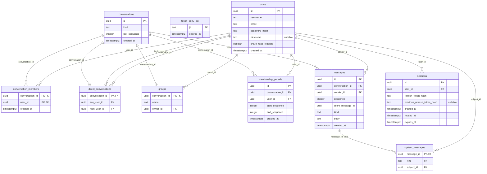

# Database ER diagram

> Generated by `pnpm docs:generate`. Do not edit by hand.

```mermaid
erDiagram
  conversation_members {
    uuid conversation_id PK, FK
    uuid user_id PK, FK
    timestamptz created_at
  }
  conversations {
    uuid id PK
    text kind
    integer last_sequence
    timestamptz created_at
  }
  direct_conversations {
    uuid conversation_id PK, FK
    uuid low_user_id FK
    uuid high_user_id FK
  }
  groups {
    uuid conversation_id PK, FK
    text name
    uuid owner_id FK
  }
  membership_periods {
    uuid id PK
    uuid conversation_id FK
    uuid user_id FK
    integer start_sequence
    integer end_sequence
    timestamptz created_at
  }
  messages {
    uuid id PK
    uuid conversation_id FK
    uuid sender_id FK
    integer sequence
    uuid client_message_id
    text kind
    text body
    timestamptz created_at
  }
  sessions {
    uuid id PK
    uuid user_id FK
    text refresh_token_hash
    text previous_refresh_token_hash "nullable"
    timestamptz created_at
    timestamptz rotated_at
    timestamptz expires_at
  }
  system_messages {
    uuid message_id PK, FK
    text kind FK
    uuid subject_id FK
  }
  token_deny_list {
    text jti PK
    timestamptz expires_at
  }
  users {
    uuid id PK
    text username
    text email
    text password_hash
    text nickname "nullable"
    boolean share_read_receipts
    timestamptz created_at
  }
  conversations ||--o{ conversation_members : "conversation_id"
  conversations ||--o{ membership_periods : "conversation_id"
  conversations ||--o{ messages : "conversation_id"
  conversations ||--|| direct_conversations : "conversation_id"
  conversations ||--|| groups : "conversation_id"
  messages ||--o{ system_messages : "message_id, kind"
  users ||--o{ conversation_members : "user_id"
  users ||--o{ direct_conversations : "high_user_id"
  users ||--o{ direct_conversations : "low_user_id"
  users ||--o{ groups : "owner_id"
  users ||--o{ membership_periods : "user_id"
  users ||--o{ messages : "sender_id"
  users ||--o{ sessions : "user_id"
  users ||--o{ system_messages : "subject_id"
```
