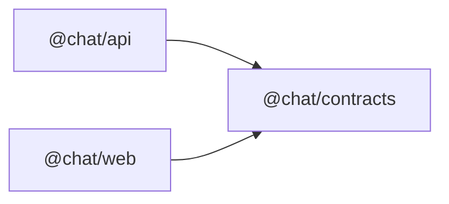

# Package graph

> Generated by `pnpm docs:generate`. Do not edit by hand.

An arrow means "depends on".

```mermaid
graph LR
  _chat_api["@chat/api"]
  _chat_contracts["@chat/contracts"]
  _chat_web["@chat/web"]
  _chat_api["@chat/api"] --> _chat_contracts["@chat/contracts"]
  _chat_web["@chat/web"] --> _chat_contracts["@chat/contracts"]
```
